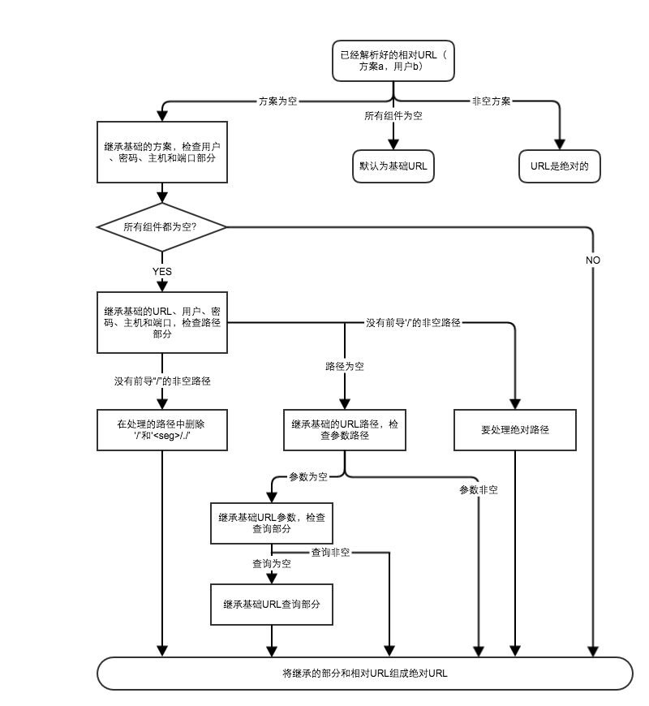

# Part02 URL与资源

### 2.1 浏览网络资源
&emsp;&emsp;URL可以他通过HTTP及之外的协议来访问资源。他们可以指向网络上的任意资源，或者个人E-mail账户：mailto:president@whitehouse.gov，或者通过其他协议访问各种文件：ftp://ftp.xxx.com/book.xls，或者从流视频服务器上下载电影：rstp://www.xxx.com:1234/video/1/。

### 2.2 URL语法

&emsp;&emsp;1、通用格式：
```xml
<schema>://<user>:<password>@<host>:<port>/<path>;<params>?<query>#<frag>
```
&emsp;&emsp;几乎没有哪个URL包含所有这些组件，最重要的三部分是 schema, host, path。各部分解释如下：  
  

| 组件 | 描述                                                                                        | 默认值                   |  
| -------   | -------                                                                               | --------                 |  
| 方案 | 访问服务器获取资源时要使用哪种协议                                                              | 无                       |  
| 用户 | 某些方案访问资源时需要用户名                                                                   | 匿名                     |  
| 密码 | 用户名后面可能要包含的密码，中间由冒号隔开                                                      | &lt;E-mail&gt;地址（什么鬼？） |  
| 主机 | 资源宿主服务器的主机名或点分IP地址                                                             | 无                       |  
| 端口 | 资源宿主服务器正在监听的端口，很多方案都有默认端口，HTTP是80端口                                  | 因方案而异               |  
| 路径 | 服务器上资源的本地名，由一个斜杠（/）分隔开，路径组件的语法与服务器和方案有关                       | 无                       |  
| 参数 | 某些方案用这个部分指定输入参数，参数以键值对形式，他们之前用分号隔开                               | 无                       |  
| 查询 | 查询部分没有通用格式，用?与其他部分隔离隔离开                                                   | 无                       |  
| 片段 | 一小片或一部分资源的名字，这个字段不会被传递到服务器，只在客户端内部使用，通过#与其他部分分离开        | 无                       |  


##### 2.2.1 方案--使用什么协议
&emsp;&emsp;1、方案必须使用字母开始，由第一个冒号与剩余部分分离开。  
&emsp;&emsp;2、方案名大小写等价。

##### 2.2.3 用户名和密码
&emsp;&emsp;1、有些服务器要求输入用户名密码才能使用，常见的有FTP服务器。  
&emsp;&emsp;2、对 ftp://ftp.xxx.com/pub/gex 没有指定用户名和密码，浏览器通常会插入默认用户名anonymous，并发送默认密码（因浏览器而异，例如IEUser、mozilla）。

##### 2.2.5 参数
&emsp;&emsp;URL的路径组件可以分成若干段，每段都有自己的参数。例如：
```url
http://www.xxx.com/hammer;sale=false/index.html;graphics=true
```

##### 2.2.6 查询字符串
&emsp;&emsp;除了对非法字符线之外，查询字符串对格式没什么要求。通常，查询字符串以键值对形式出现，键值对之间用&分开。

##### 2.2.7 片段
&emsp;&emsp;1、服务器通常只处理整个对象，而不是片段。所以客户端不能将片段发送给服务器，浏览器获取整个资源后，会根据片段来显示用户感兴趣的那部分。  
&emsp;&emsp;2、片段挂在URL最右边，用#与其他部分分开。

### 2.3 URL快捷方式

##### 2.3.1 相对URL
&emsp;&emsp;1、相对URL是不完整的，需要相对于基础URL进行解析。解析流程：


### 2.4 各种令人头疼的字符
&emsp;&emsp;1、URL在传递过程中必须保持完整，但有些协议（SMTP）为了安全会剥去一些特定的字符，为了避免这样的问题，URL只能使用一些相对较小、通用安全的字母表中的字符。  
&emsp;&emsp;2、URL中可能会包含安全字母表之外的二进制数据或字符，因此需要对URL进行转义。  

##### 2.4.1 URL字符集
&emsp;&emsp;ASCII表使用历史悠久，故移植性好。再通过将转义序列集成，就可以对任意字符值或数据进行编码，实现可移植和完整性。

##### 2.4.2 编码机制
&emsp;&emsp;对于不安全编码，使用转义表示法。通过一个百分号加两个16进制字符的ASCII码来表示。例如空格ASCII是32，转义后是%20。

##### 2.4.3 字符限制
&emsp;&emsp;URL中，有几个字符被保留，具有特殊含义，有些字符不可打印或者与其他协议产生混淆，故不赞成使用。如下字符，用于保留用途之外时，需要进行编码。

|字符|保留/受限|
|---|---|
|%|保留用作编码转义|
|/|保留作为路径分隔的定界符|
|.|保留在路径组件中使用|
|..|保留在路径中使用|
|#|保留作为分段定界符|
|?|保留作为查询字符串定界符|
|;|保留作为参数定界符|
|:|保留作为方案、用户/口令、主机/端口的定界符|
|$ +|保留|
|@ & =|方案的上下文中有特殊含义|
|{} &#124; \\ ^ ~ [ ]|由于各种传输Agent代理，比如各种网关的不安全处理，使用受限|
|&gt; &lt; " |不安全，通常在URL外具有特殊意义|
|0x00-0x1F, 0x7F|受限，是不可打印字符|
| &gt;7F|受限，超出了ASCII的7bit范围|

##### 2.4.4 另外一点说明
&emsp;&emsp;有时使用了不安全字符，依然可以正常工作。但还是建议对字符编码，这个URL才可以在各种应用程序之间无歧义的传输。

### 2.5 方案的世界
&emsp;&emsp;常见的方案：

|方案|描述|
|---|---|
|http|超文本传输协议，除了没有用户名和密码，与通用的URL格式相符|
|https|与http的唯一区别在于使用了SSL。SSL为HTTP提供了端到端的加密，语法与HTTP一致，默认端口443|
|mailto|指向E-mail地址。E-mail地址并不指向可以直接访问的对象，其格式和标准URL有所不同|
|ftp|可以向FTP服务器上传、下载文件，并获取服务器的目录结构|
|rtsp, rtspu|rstp URL是可以通过实时流传输协议（Real Time Streaming Protocol）解析的音视频媒体资源标识符。rstpu的U是使用UDP来获取资源|
|file| 表示一台主机上可以直接访问的文件，省略主机认为是使用本机地址|
|news|根据RFC 1036的定义，方案news用来访问一些特定的文章或者新闻组|
|telnet|用于访问交互式业务，表示的并不是对象本身，而是可以通过Telnet协议访问的交互式应用程序|
