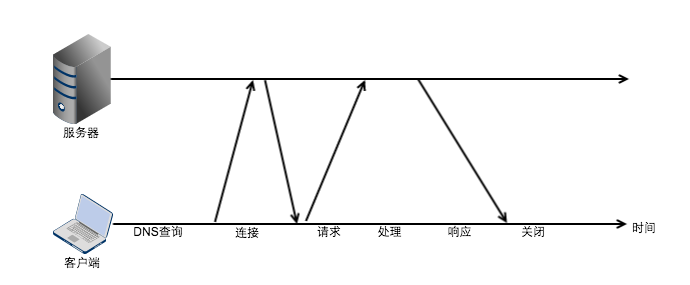
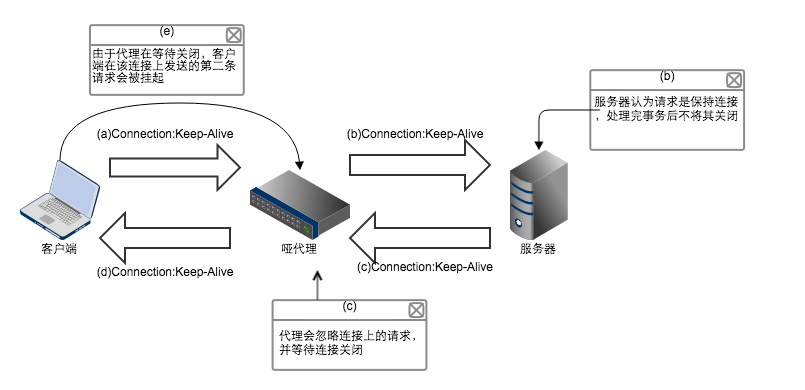

# Part04 连接管理

### 4.1 TCP连接
&emsp;&emsp;几乎所有的HTTP通信都是由TCP/IP承载的，一旦建立一条TCP/IP连接，客户端和服务端之间的报文就永远不会丢失、受损、失序。

##### 4.1.2 TCP流是分段的、由IP分组传送
&emsp;&emsp;1、TCP的数据是通过IP分组来发送的。HTTP是“HTTP over TCP over IP”这个协议栈的最顶层，其安全版本HTTPS是在HTTP和TCP之间插入一个密码加密层（SSL）。  


&emsp;&emsp;2、HTTP要发送一条报文，以流的形式在一条打开的TCP连接上传输，TCP收到数据流，将数据流分成‘段’，并将‘段’封装在IP分组里，通过因特网传输。这些工作有TCP/IP软件完成，HTTP程序员什么都看不见啊。  

&emsp;&emsp;3、每个TCP段由IP分组承载，从一个IP地址发送到另一个IP地址，每个IP分组包括：  

 - 一个IP分组首部（通常20个字节）
 - 一个TCP段首部（通常20个字节）
 - 一个TCP数据库（0或多个字节）

&emsp;&emsp;4、IP首部包含了源和目的的IP地址、长度和其他一些标记。TCP首部包含了TCP的端口号、TCP控制标记，以及数据排序和完整性检测的一些数值。

##### 4.1.3 保持TCP连接持续不断的运行

&emsp;&emsp;1、任意时刻，计算机都有多条TCP连接，通过端口号区分这些连接，并可以同时处于打开状态。IP地址可以连接到正确的计算机，端口号连接到对应的应用程序上去。   


&emsp;&emsp;2、【源IP地址、源端口号、目的IP地址、目的端口号】4个值唯一的确定一条连接。

### 4.2 对TCP性能的考虑

&emsp;&emsp;1、HTTP紧挨着TCP，所以HTTP事务的性能很大程度上取决于底层TCP通道的性能。

##### 4.2.1 HTTP事务的时延
<center></center>    
<center>串行HTTP事务的时间线</center>   

&emsp;&emsp;由上，HTTP 时延的主要原因有：

 1. 根据URL确定IP地址和端口。最差的情况下，可能持续数十秒。
 1. 向服务器发送TCP请求并等待应答。每条TCP连接都有建立时延。
 1. 建立了连接后，客户端通过TCP向服务端发送HTTP请求。Web服务器从TCP连接中读取报文并处理。因特网传输报文和处理报文需要时间。
 1. Web服务器回送HTTP响应，传输HTTP响应需要时间。

&emsp;&emsp;这些时延取决于硬件速度、网络和服务器负载、请求报文响应报文的大小，以及客户端与服务端之间的距离。TCP技术的复杂性也会对时延产生影响。  

##### 4.2.2 性能聚焦区域

 常见的TCP时延：

 1. TCP连接建立握手
 2. TCP慢启动拥塞控制
 3. 数据聚集的Nagle算法
 4. 用于捎带确认的TCP延迟算法
 5. TIME_WAIT时延和端口耗尽

##### 4.2.3 TCP连接的握手时延
&emsp;&emsp;1、在发送任意数据之前，TCP软件之间都会交换一系列的IP分组，对连接的参数进行沟通。**如果连接只是用来传递少量的数据，这些交换过程就会严重降低HTTP性能**

&emsp;&emsp;2、在发送数据之前，TCP要收发（从客户端开始）两个分组来建立连接。

&emsp;&emsp;TCP的3次握手：

 - 握手1. 客户端向服务端发送一个小的TCP分组（一般40~60字节），设置了特殊的SYN标记，说明这是一个连接请求。   
 - 握手2. 如果服务器接收了连接，就会对连接参数进行计算，并回送一个TCP分组，分组中SYN和ACK都被置位，说明请求已被接受。   
 - 握手3. 最后，客户端向服务端回送一条确认消息，通知连接已经成功建立。**现代的浏览器都允许客户端在这个确认分组中发送数据。**   

&emsp;&emsp;3、HTTP事务通常不会交换太多数据SYN/SYN+ACK产生一个可测量时延。   
&emsp;&emsp;4、TCP连接的ACK分组（握手的第三步）通常足够大，可以承载整个HTTP报文。   
&emsp;&emsp;5、最后，小的HTTP事务可能会在TCP建立连接上花费50%的时间或更多（小文件一次响应就发送完成）。   


##### 4.2.4 延迟确认

&emsp;&emsp;1、由于网络不能保证分组的传输（网络路由器超负荷会任意丢弃分组），所以TCP靠自己的确认机制来确保数据传输成功。   
&emsp;&emsp;2、 每个TCP段都有一个**序列号**和**校验和**，每个段的接收者会回送小的确认分组。如果发生者在指定时间内没有收到确认信息，发送者认为分组已破坏并重新发送。  
&emsp;&emsp;3、由于**确认报文很小**，所以TCP允许发往相同方向的输出数据分组中进行**捎带**。  
&emsp;&emsp;4、为了增加确认报文找到同向传输数据分组的可能性，很多TCP都实现了“延迟确认”算法。即在一个特定的时间窗口内（一般是100~200毫秒）将确认信息放在**缓冲区**，以寻找可以捎带它的分组，如果这段时间内没有这个方向的输出分组，就单独在分组中发送该确认。   
&emsp;&emsp;5、但是，HTTP具有双峰特征（发送和接收基本都是单向的发送数据）的请求 - 应答行为降低了捎带信息的可能。当希望向相反方向回传分组时，偏偏没有那么多可以用。此时，延迟确认算法反而会引入相当大的延时，可以根据不同操作系统来禁止或者调整延迟确认算法。

##### 4.2.5 TCP慢启动

&emsp;&emsp;1、TCP连接会随着时间自我调节。起初会限制连接速度，如果传输数据成功，会随着时间推移提高传输速度。这种调节称为**慢启动**，用于放置因特网的突然**过载和拥塞**。   
&emsp;&emsp;2、TCP慢启动限制了在任意时刻传输的分组数。在成功发送一个分组后，就有了发送两个分组的权限，如果下次的两个**都发**送成功，就可以发送四个分组，以此类推。这种方式叫打开拥塞窗口。   

##### 4.2.6 Nagle算法和TCP_NODELAY
&emsp;&emsp;1、TCP有一个数据流接口，应用程序可以将任意大小数据放入TCP栈中，即使以此放一个字节。但是，每个TCP段包含至少40字节的标记和首部，所以TCP发送**大量小分组**时，网络性能将急剧下降。（*发送大量单字节分组的行为称为“发送端傻窗口综合症”，这种行为效率很低，违反**社会道德**，甚至可能影响其他因特网流量*）。   
&emsp;&emsp;2、Nagle算法试图发送一个分组前，将大量TCP数据绑定在一起，，以提高利用率。但可能永远等不到额外数据填满一个分组而产生时延。另外还和延迟确认存在交互问题。  
&emsp;&emsp;3、HTTP通常会设置TCP_NODELAY来禁用Nagle算法。

##### 4.2.7 TIME_WAIT累积与端口耗尽

&emsp;&emsp;1、TIME_WAIT端口耗尽是非常严重的性能问题，但很少出现。   
&emsp;&emsp;2、某个TCP端关闭连接后，会在内存中维护一个小的控制块，记录最近关闭连接的IP地址和端口号。   
&emsp;&emsp;3、这个信息只会维持一小段时间（小于2分钟，以前网络很慢，网络中的分组在丢弃前可以存活1分钟左右，现在这个时间已经小得多），确保这段时间内不创建相同IP地址和端口号的连接。   
&emsp;&emsp;4、所以如果这个小的时间段内，有大量的连接出现，会将端口耗尽。   
&emsp;&emsp;5、为了避免这个问题，可以增加客户端负载生成机器的数量。或者服务端和客户端循环使用虚拟IP来增加可用连接数。   

### 4.3 HTTP连接的处理

##### 4.3.1 常被误解的Connection首部
&emsp;&emsp;1、在某些情况下加，两个相邻的HTTP应用程序会为他们共享的连接应用一组选项。HTTP的Connection首部字段中有一个由逗号分隔的**连接标签列表**，这些标签为此连接指定了一些不会传播到其他连接中去的选项。例如Connection:close说明发送完下一条报文后必须关闭连接。   
&emsp;&emsp;2、Connection首部可以承载3种不同类型的标签，有时令人费解：  
&emsp;&emsp;1）HTTP首部字段名，列出只与本条连接有段的首部   
&emsp;&emsp;2）任意标签值，与此连接的非标准选项   
&emsp;&emsp;3）close，说明操作完成后关闭这条非持久化连接   
&emsp;&emsp;如果连接中包含HTTP首部字段的名称，接收者会解析并应用这些首部，但在报文转发出去之前，必须删除Connection首部的所有字段。由于Connection首部可以防止无意中对本地首部的转发，因此将逐跳首部放入Connection首部被称为**对首部的保护**。

##### 4.3.2 串行事务处理时延
&emsp;&emsp;串行事务的缺点是给人感觉很慢，页面假死。另外浏览器需要知道资源尺寸后才能正常显示，对用户来说就是浏览器空白着。

### 4.4 并行连接
&emsp;&emsp;HTTP允许客户端打开多条连接，并行的执行多个HTTP事务。

##### 4.4.1 并行连接**可能**会提高页面的加载速度
&emsp;&emsp;1、在带宽较小，多条连接会竞争加载导致变慢。另外如果连接太多消耗太多资源也会变慢。
&emsp;&emsp;2、浏览器确实会使用并行连接，但限制在较小的数量（通常4个）。服务器也可以随意关闭来自某个客户端的超量连接。

### 4.5 持久连接

&emsp;&emsp;1、页面内容较多时，有一直有连接连到服务器。因此，在初始化了对服务器的连接后，很有可能会在不久的将来对服务器发起更多的连接。这也叫**站点局部性**。   
&emsp;&emsp;2、因此，1.1版本中，允许在事务处理结束后，将TCP连接保持在打开状态，以便为将来的HTTP请求重用。这种连接也叫**持久化连接**。   
&emsp;&emsp;3、持久化连接会在不同事务之间保持打开，直到客户端或者服务端绝对关闭它为止。  
&emsp;&emsp;4、持久连接的好处是避开缓慢的建立连接过程和慢启动过程。  

##### 4.5.1 持久及并行连接
&emsp;&emsp;1、持久连接减少了打开连接的潜在数量。但管理持久连接要小心，不然会积累出大量空闲连接而耗费资源。  
&emsp;&emsp;2、持久连接和并行连接配合可能是最高效的方式。  
&emsp;&emsp;3、持久连接分两种，老的HTTP/1.0和keep-alive和HTTP/1.1的persistent连接。  

##### 4.5.2 HTTP/1.0 + keep-alive连接
&emsp;&emsp;持久连接去除了慢启动阶段，请求和响应时间也有可能缩减。

##### 4.5.3 keep-alive操作
&emsp;&emsp;1、keep-alive在1.1规范里不再说明（弃用），但浏览器和服务器一栏使用keep-alive握手。   
&emsp;&emsp;握手过程：   
&emsp;&emsp;2、实现了keep-alive连接的客户端可以通过包含Connection:Keep-Alive首部，将这条连接保持在打开状态。   
&emsp;&emsp;3、如果服务器也愿意保持连接，就回送一个也包含Connection:Keep-Alive的首部。   
&emsp;&emsp;4、如果响应中没有该首部，客户端就认为服务器不支持keep-alive，会在发送响应报文后关闭连接。   

##### 4.5.4 Keep-Alive选项
&emsp;&emsp;1、注意，客户端和服务器都可以 1⃣️ 发起keep-alive连接 2⃣️ 是否要保持keep-alive连接。   
&emsp;&emsp;2、可以用Keep-Alive通用首部指定由逗号隔开的选项来调节keep-alive行为：   
&emsp;&emsp;① timeout参数在Keep-Alive响应首部发送，估计了服务器希望将连接保持的时间，但这并不是承诺值。   
&emsp;&emsp;② max在Keep-Alive首部发送，估计了服务器希望为多少个事务保持连接的活跃状态，但并不是承诺值。   
&emsp;&emsp;③ 支持的其他任意未经处理的特性，用于诊断和调试。语法为 name[=value]。     
&emsp;&emsp;3、Keep-Alive首部完全是可选的，但只在提供了Connection:Keep-Alive时才能使用它。   
&emsp;&emsp;4、一个Keep-Alive首部🌰：

```
Connection:Keep-Alive
Keep-Alive:max=5, timeout=120
```
&emsp;&emsp;这里服务器还会为另外五个事务保持连接的打开状态，或者在连接空闲了后，保持该连接2分钟。

##### 4.5.5 Keep-Alive连接的限制和规则
&emsp;&emsp;1、1.0中Keep-Alive不是默认打开的，客户端要发送Connection:Keep-Alive首部来激活。   
&emsp;&emsp;2、keep-alive首部必须随所有希望保持持久连接的报文一起发送，否则服务器在没收到该首部后关闭连接。   
&emsp;&emsp;3、客户端也可以检测有无该首部来判断服务器发出响应后是否关闭连接。  
&emsp;&emsp;4、（拗口描述预警）只有在无需检测到连接的关闭即可确定报文实体部分长度的情况下，才能将连接保持在打开状态——也就是说，实体的主体部分必须有正确的Content-Length，有多媒体类型，或者用分块传输编码的方式进行了编码。在一条keep-alive信道中发送错误的Content-Length是很糟糕的事，这样事务的另一端就无法精确的检测一条报文的结束和另一条报文的开始。
&emsp;&emsp;5、代理和网关必须执行Connection首部的规则。   
&emsp;&emsp;6、严格的说，不该与无法确认支持Connection首部的代理服务器建立keep-alive连接，以防止哑代理出现，但现实中总无法避免。   
&emsp;&emsp;7、技术上应该忽略来自HTTP/1.0的Connection首部，实际上，尽管可能会有在老服务器上挂起的危险，有些客户端和服务器还是会违反这个规则。   
&emsp;&emsp;8、如果客户端收到完整响应前连接关闭，客户端要做好重试准备。

##### 4.5.6 Keep-Alive和哑代理
&emsp;&emsp;Connection:Keep-Alive首部只会对这条离开的TCP链路产生影响。这就是称作其为“连接首部”的原因。

&emsp;&emsp;1）Connection首部和盲中继   
&emsp;&emsp;1、问题出在不理解Connection首部的代理商。特别是在转发之前不知道将Connection首部删除的代理。   
&emsp;&emsp;2、很多老的、简单的代理都是**盲中继**，它们只是将字节从一个连接转发到另一个连接，不对Connection首部做处理。    
<center></center>
<center>keep-alive无法与不支持Connection的代理互操作</center>

&emsp;&emsp;上图解释：  
&emsp;&emsp;1. 哑代理接受HTTP请求，但并不知道Connection首部的含义，然后会一字不漏的转发给服务器。由于Connection首部是**逐跳**首部，只适用于单条传输链路，不应该沿着传输链路向下传输。   
&emsp;&emsp;2. 服务器收到请求，误以为代理希望进行keep-alive对话，并回送Connection:Keep-Alive首部。  
&emsp;&emsp;3. 客户端收到后，认为服务器同意keep-alive对话，此时客户端和服务端都认为在进行keep-alive对话。  
&emsp;&emsp;4. 但中间的代理并不知道keep-alive是神马，于是就一直等待源端服务器关闭连接，但源端服务器认为这是keep-alive连接，是不会关闭连接的。这样，代理服务器就会挂在那里，一直等待关闭。  
&emsp;&emsp;5. 客户端收到响应，在keep-alive上发送二次请求时，但代理不会认为有请求，会忽略客户端的二次请求，这时浏览器就一直转圈不会有任何进展。这种错误导致浏览器一直挂起，直到超时，服务端或者客户端将连接关闭为止。   
&emsp;&emsp;6. 很多类似情形，盲中继的握手和转发都会导致这个问题。  

&emsp;&emsp;2）代理和逐跳首部
&emsp;&emsp;1、为了避免上述问题，现代代理都不能转发Connection首部和所有出现在Connection首部的名字。
&emsp;&emsp;2、除此之外，代理也不能转发缓存相关首部，包括Proxy-Authorization、Proxy-Connection、Transfer-Encoding和Upgrade。

##### 4.5.7 插入Proxy-Connection
&emsp;&emsp;1、NetScape最盲中继提出了变通的做法，不要求所有web应用程序都支持高版本HTTP。   
&emsp;&emsp;2、通过引入Proxy-Connection首部，解决了客户端后面**紧跟**盲中继带来的问题，但并没有解决所有其他情况下存在的问题。现代浏览器很多都能理解这个首部。   
&emsp;&emsp;3、如果代理比较笨，直接转发Proxy-Connection，不会造成问题。如果代理比较聪明，会把Proxy-Connection用Connection首部取代，达到预期效果。  
&emsp;&emsp;4、但哑代理和聪明代理同时出现，还是会导致上面的问题。而且，网络中代理可以是防火墙、拦截缓存等，对浏览器不可见，所以浏览器不会发送Proxy-Connection。透明的web应用程序正确的实现持久化连接非常的重要。   

##### 4.5.8 HTTP/1.1 持久连接
&emsp;&emsp;1、1.1逐渐停止了对keep-alive的支持，用名为**持久连接（persistent connection）**来代替。   
&emsp;&emsp;2、默认情况下，持久连接是激活的。如果要关闭连接，必须在报文中显示的添加Connection:close首部。   
&emsp;&emsp;3、但是，客户端和服务器也可以随时关闭连接，不发送Connection:close并不是承诺将连接一直保持在打开状态。   

##### 4.5.9 持久连接的限制和规则
&emsp;&emsp;1、实体部分长度和Content-Length一致时，或者是用分块传输编码方式编码时，连接才能保持持久。   
&emsp;&emsp;2、每个持久连接只适用于一跳传输。   
&emsp;&emsp;3、由于老代理会转发Connection首部，所以1.1的服务器应拒绝和1.0的服务器建立持久连接。但实际大多厂商违背这个原则。   
&emsp;&emsp;4、1.1的设备可以在任意时刻关闭连接。   
&emsp;&emsp;5、1.1的应用程序能够从异步的关闭中恢复过来，即重试这条请求。   
&emsp;&emsp;6、一个客户端对任何代理只能维持至多两个持久连接，如果有N个用户试图访问服务器，代理上至多维护2N个持久连接。   

### 4.6 管道化连接

&emsp;&emsp;1、1.1允许在持久连接上可选的使用请求管道。  
&emsp;&emsp;2、在响应到达之前，可以将多条请求放入队列。当第一条达到目的地后，剩下的请求也就可以发送了。在高时延网络下，可以降低网络回环时间。  
&emsp;&emsp;3、对管道化的限制：  
&emsp;&emsp;A 如果客户端取法确认连接是持久的，就不该使用管道。   
&emsp;&emsp;B 必须按照请求顺序回送响应（HTTP报文中无序列号标签）。   
&emsp;&emsp;C 客户端随时做好连接被关闭的准备，还要准备好重发所有未完成的管道化请求。   
&emsp;&emsp;D 客户端不应以管道化方式发送会产生副作用的请求（如POST）。   


### 4.7 管道化连接

##### 4.7.1 “任意”解除连接
&emsp;&emsp;所有服务器、客户端、代理都可以**任意时刻**关闭TCP连接。

##### 4.7.2 Content-Length及截尾操作
&emsp;&emsp;1、每条HTTP响应都应该有**精确的**Content-Length首部，特别是在使用持久连接的情况下。   
&emsp;&emsp;2、不包含或包含错误长度时，只有依赖服务器发出的关闭连接来判断数据的真实末尾。   
&emsp;&emsp;3、客户端和代理收到一条随连接关闭而结束的HTTP响应时，如果传输的实际长度和Content-Length不匹配，接收端就应该质疑长度的正确性。   
&emsp;&emsp;4、如果接收端是缓存代理，就不该缓存这条响应。代理应该将有问题的报文原封不动的转发出去，不应该去校正，以维护语义的透明性。

##### 4.7.3 连接关闭容限、重试以及幂等性

&emsp;&emsp;1、即使是非错误情况，连接也可能随时被关闭，所以HTTP应用程序应该做好正确处理非预期关闭连接的准备。   
&emsp;&emsp;2、如果一个事务，不管是执行一次还是多次，得到的结果是相同的，则这个事务是**幂等**的。除了POST外，其他都是幂等操作。   
&emsp;&emsp;3、客户端不应以管道化方式传送非幂等请求，如果管道内某个请求出错，可能导致重试过程中多次的POST请求。   
&emsp;&emsp;4、用户代理可能会让操作员来选择是否对请求进行重试，但一定不能自动重试非幂等方法或序列。   

##### 4.7.4 正常关闭连接
###### 1. 完全关闭与半关闭
&emsp;&emsp;1、应用程序可以关闭TCP输入和输出信道中的任意一个，或者两个都关闭。套接字调用close()会将TCP连接的输入和输出都关闭，也叫完全关闭。调用shutdown()单独关闭输入和输出连接，也叫半关闭。   
###### 2. TCP关闭及充值错误
&emsp;&emsp;1、简单HTTP程序可以只使用完全关闭。当应用程序和许多其他类型使用管道化连接时，使用**半关闭**来防止对等实体收到非预期的写入错误就变得很重要了。   
&emsp;&emsp;2、关闭连接的输出信道**总是安全**的，连接另一端的对等实体从缓冲区读数据，读完所有数据后会收到通知，说明流结束，这样他就知道你要将连接关闭。   
&emsp;&emsp;3、关闭连接的输入信道比较危险，除非知道了连接的对端不再发生数据。  
&emsp;&emsp;4、如果另一端向已关闭的输入信道发生数据，操作系统会回送TCP连接被重置报文。大部分操作系统都将这种情况视为严重错误来处理，删除对端还未读取的所有缓存数据。特别是对于管道化连接来说，是非常糟糕的事情。

###### 3. 正常关闭
&emsp;&emsp;1、HTTP规范建议，当要关闭一条连接时，应*正常的关闭*连接，但具体没说明怎么做。（黑人？？）  
&emsp;&emsp;2、总之，关闭连接的一般步骤：  
&emsp;&emsp;A 首先关闭输出信道  
&emsp;&emsp;B 等待对端实体关闭输入信道  
&emsp;&emsp;C 当两端都告诉对方不在发送数据之后，连接会被完全关闭   
&emsp;&emsp;3、不幸的是，无法确认对等实体会实现半关闭，或对其进行检查。  
&emsp;&emsp;4、要想正常关闭的话，在关闭了输出信道后，应**周期性**的检查输入信道，查找数据或流的末尾。如果一段时间内对端没有关闭输入信道，应用程序可以强制关闭连接，以节省资源。


